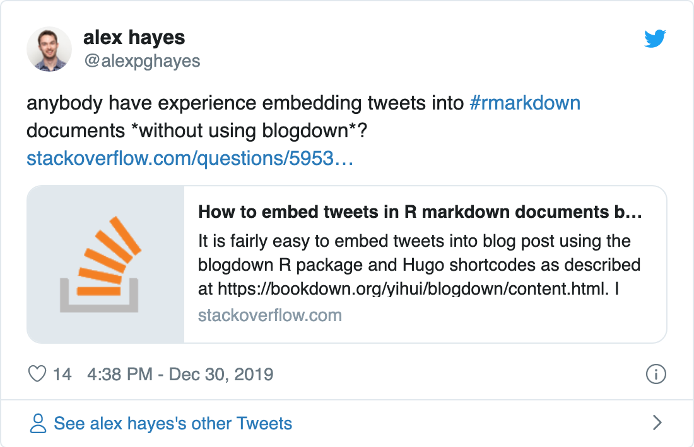
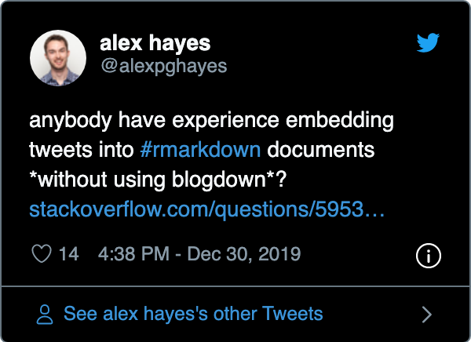

<!-- README.md is generated from README.Rmd. Please edit that file -->

# tweetrmd

<!-- badges: start -->

<!-- badges: end -->

Easily embed Tweets anywhere R Markdown turns plain text into HTML.

## Installation

You can install the released version of **tweetrmd** from GitHub:

``` r
# install.packages("devtools")
devtools::install_github("gadenbuie/tweetrmd")
```

## Embed a Tweet

``` r
library(tweetrmd)
tweet_embed("https://twitter.com/alexpghayes/status/1211748406730706944")
```

<!--html_preserve-->

<blockquote class="twitter-tweet" data-width="550" data-lang="en" data-dnt="true" data-theme="light">

<p lang="en" dir="ltr">

anybody have experience embedding tweets into
<a href="https://twitter.com/hashtag/rmarkdown?src=hash&amp;ref_src=twsrc%5Etfw">\#rmarkdown</a>
documents *without using
blogdown*?<a href="https://t.co/5kQUBh7j4g">https://t.co/5kQUBh7j4g</a>

</p>

— alex hayes (@alexpghayes)
<a href="https://twitter.com/alexpghayes/status/1211748406730706944?ref_src=twsrc%5Etfw">December
30, 2019</a>

</blockquote>

<!--/html_preserve-->

Or if you would rather use the screen name and status id.

``` r
tweet_embed(tweet_url("alexpghayes", "1211748406730706944"))
```

<!--html_preserve-->

<blockquote class="twitter-tweet" data-width="550" data-lang="en" data-dnt="true" data-theme="light">

<p lang="en" dir="ltr">

anybody have experience embedding tweets into
<a href="https://twitter.com/hashtag/rmarkdown?src=hash&amp;ref_src=twsrc%5Etfw">\#rmarkdown</a>
documents *without using
blogdown*?<a href="https://t.co/5kQUBh7j4g">https://t.co/5kQUBh7j4g</a>

</p>

— alex hayes (@alexpghayes)
<a href="https://twitter.com/alexpghayes/status/1211748406730706944?ref_src=twsrc%5Etfw">December
30, 2019</a>

</blockquote>

<!--/html_preserve-->

In rich HTML outputs, the full embedded tweet is available and
interactive. Here, in GitHub-flavored markdown, only the content of the
tweet is seen.

## Take a screenshot of a tweet

Screenshots are automatically embedded in R Markdown documents, or you
can save the screenshot as a `.png` or `.pdf` file. Uses the
[rstudio/webshot2](https://github.com/rstudio/webshot2) package.

``` r
tweet_screenshot(tweet_url("alexpghayes", "1211748406730706944"))
```



## Just include a tweet in any R Markdown output format

When you want to include a tweet in multiple R Markdown formats, you can
use `include_tweet()`. It’s like `knitr::include_graphics()` but for
tweets. The function will automatically include the tweet as HTML in
HTML outputs, or as a screenshot in all others.

```` markdown
```{r tweet-from-dsquintana}
include_tweet("https://twitter.com/dsquintana/status/1275705042385940480")
```
````


## Customize tweet appearance

Twitter’s [oembed
API](https://developer.twitter.com/en/docs/tweets/post-and-engage/api-reference/get-statuses-oembed)
provides a number of options, all of which are made available for
customization in `tweet_embed()` and `tweet_screenshot()`.

``` r
tweet_screenshot(
  tweet_url("alexpghayes", "1211748406730706944"),
  maxwidth = 300,
  hide_media = TRUE,
  theme = "dark"
)
```



## Caching tweets with memoization

Tweets are often deleted and re-running `tweet_embed()` or
`tweet_screenshot()` may fail or overwrite a previous screenshot of a
tweet. To avoid this, you can use the
[memoise](https://github.com/r-lib/memoise) package.

``` r
library(memoise)

tweet_cached <- memoise(tweet_embed, cache = cache_filesystem('.tweets'))
tweet_shot_cached <- memoise(tweet_screenshot, cache = cache_filesystem('.tweets'))
```

<sup>\*</sup>When memoising `tweet_screenshot()` you need to manually
save the file to a specific location. In the future my goal is for this
to be automatic.

-----

Note: When using `tweet_embed()`, you may need to add the following line
to your YAML header for strict markdown output formats.

``` yaml
always_allow_html: true
```
